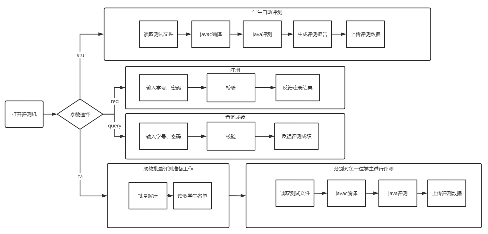

# 评测机开发总结文档

## 设计目标

- 方便学生进行自助评测及根据评测机反馈的评测报告进行快捷调试。
- 方便助教对学生提交的程序进行批量评测，根据一定的算法进行评分。
- 提供一个查询助教黑盒评测结果的接口，学生只能查询自己的成绩。
- 接入数据库，记录学生平时评测的情况，借此反映学生的学习情况，可进行大数据统计分析。

## 功能介绍

该评测机针对面向学生自测、面向助教批量评测、成绩查询分为了三个主要的大模块。具体功能介绍如下。

### 面向学生

学生个人可使用该评测机对项目根据测试文件的标准读入和输出内容进行评测。

- 多测试文件支持：评测机编译项目后，可依次对所提供的多个测试文件进行评测。
- 查看评测报告：评测完成后将生成评测报告。内容包括：
  - 是否与正确输出一致
  - 是否超时
  - 输出的哪一行出错了
  - 截至出错行处的所有读入命令，以便调试
  - 完整期望输出与完整实际输出

### 面向助教

助教可指定多个评测点，对所有同学打包后的 zip 程序包进行批量评测。

- 设定若干评测点后，对每一位同学的程序进行编译、评测（评测结果将上传至数据库）

注：所有评测结果将上传至数据库。评测结果数据库分为两个：

- 学生自助评测结果数据库：以便于统计学生们的学习情况。
- 助教正式的黑盒评测结果数据库：用于最终的成绩统计。

### 成绩查询

评测机提供了成绩查询接口。目的是出于隐私的考虑，让每位学生只能查看自己的成绩。

- 学生注册账号，绑定学号、密码。
- 输入密码正确后方可查询在助教处黑盒测试的正式评测结果。

## 设计思路

### 设计出发点

- 通过输入的参数控制，将提供给助教和提供给学生的评测机集成至同一个评测机中，以模拟提供官方评测环境。
- 要支持多测试文件，便于助教进行批量多点测试。
- 生成本地评测报告要包含尽可能多的内容，便于同学们的测试与调试工作。
- 通过注册、输入密码校验让同学们只能查看自己的成绩。

### 程序流程图



## 解决方案

- 评测机主体选用 Go 语言开发，交叉编译得二进制可执行文件至 Windows、Linux、MacOS 多平台。
- Python 脚本完成批量解压、批量执行的作用。
- 数据统计分析部分通过编写 SQL 语句处理。

## 软硬件开发环境

### 硬件

- CPU: AMD R7 4800U
- Memory: 16G

### 软件

- 操作系统：Windows 10
- 评测机主体：Go 1.15
- 批量评测脚本：Python 3.8
- 数据库：MySQL
- 编辑器：VS Code
- 数据库 IDE：DataGrip

## 重点难点解析

### 如何从评测机中调用 Java 的编译、执行命令？

`os/exec`中`Command()`函数支持根据给定参数执行外部程序。

### 如何向 Java 处输入数据以及得到输出？

将 I/O 的输入输出进行重定向。（见`execute.go`）

### 如何判断编译成功或失败？

获取编译`javac`程序的返回值。若为 0，编译成功；若不为 0，编译失败，将不会进行后续的评测工作。（见`compile.go`）

### 如何判断程序超时？

使用 GoChannel 进行管道间通信。（见`execute.go`）

```go
// setup a buffer to capture standard output
var buf bytes.Buffer
// create a channel to capture any errors from wait
done := make(chan error)
go func() {
    if _, err := buf.ReadFrom(stdout); err != nil {
        panic("buf.Read(stdout) error: " + err.Error())
    }
    done <- cmd.Wait()
}()
// block on select, and switch based on actions received
select {
case <-time.After(time.Duration(timeout) * time.Second):
    if err := cmd.Process.Kill(); err != nil {
        panic("failed to kill: " + err.Error())
    }
    fmt.Println("timeout reached, process killed")
case err := <-done:
    if err != nil {
        close(done)
        panic("process done, with error: " + err.Error())
    }
}
```

### 如何交叉编译至多平台？

（见`Makefile`）

```makefile
build:
    env GOOS=windows GOARCH=amd64 go build -ldflags '-w -s' -o bin/patpat-windows-amd64.exe main.go
    env GOOS=linux GOARCH=amd64 go build -ldflags '-w -s' -o bin/patpat-linux-amd64 main.go
    env GOOS=darwin GOARCH=amd64 go build -ldflags '-w -s' -o bin/patpat-macos-amd64 main.go
# -ldflags '-w -s' 是为了去除调试信息，减小Release版本大小
```
